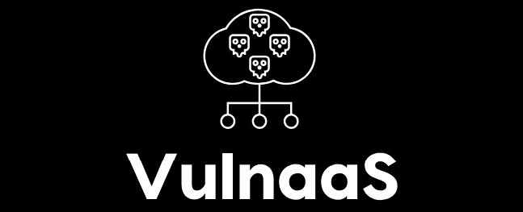
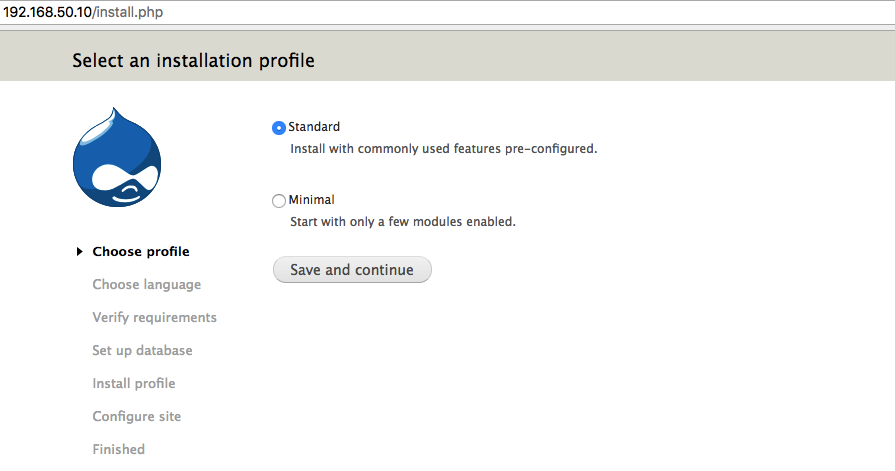

## What is VulnaaS?

VulnaaS stands for **Vulnerabilty as a Service** and is a golang API of public configuration files that may provision vulnerabilites inside boxes for research purpose. 

Developed for use by penetration testers and vulnerability researchers, its main goal is to provide public scripts to turn the process of building an intended vulnerable machine much more easier.

## Install a vulnerability? Really?

Yeah, imagine that you are a security researcher and would like to test a recently addded exploit on a Ubuntu VM such as [Drupal < 7.58 / < 8.3.9 / < 8.4.6 / < 8.5.1 - 'Drupalgeddon2' Remote Code Execution]((https://www.exploit-db.com/exploits/44449/)). 

However, there are a few services that may be installed before installing Drupal:
* Database (ex: MySQL)
* Web Server (ex: Apache2)
* PHP


Using [Vagrant](https://www.vagrantup.com/) to provision your box, you can simple add these configuration into your Vagrantfile and let VulnaaS do these tasks for you:

```
Vagrant.configure("2") do |config|
    config.vm.box = "ubuntu/trusty64"
    
    config.vm.define "vm1-drupal7-58" do |vm1|
        config.vm.network :private_network, ip: "192.168.50.10"
        vm1.vm.provision :shell, path: "https://vulnaas.com/api/install/drupal7-58", privileged: true
end
```

Up your box and enjoy your old Drupal 7.58!
```
vagrant up
```



## How does it work?

VulnaaS API is built in a manner that, for every service Drupal 7.58 requires, a new request will be make from Vagrant so it installs it before installing the CMS itself. 

In the example above, this was all the path Vagrant did until installing the vulnerability into the box: 

```
GET https://vulnaas.com/api/install/drupal7-58 (will check if apt or yum is needed)
GET https://vulnaas.com/api/scripts/apt/drupal7-58
GET https://vulnaas.com/api/scripts/apt/php
GET https://vulnaas.com/api/scripts/apt/apache2
GET https://vulnaas.com/api/scripts/apt/mysql
``` 

It is important to mention that Drupal 7.58 is the **only** service vulnerable in the box. VulnaaS service scripts installed (MySQL, PHP and Apache2) are **intended** to be secure by default.

## Where are the scripts?

All scripts from API are imported from [config.yml](config.yml) using [Viper](https://github.com/spf13/viper). These are some examples:

Apache2 service script:

```ruby
id: 1002
    alias: apache2
    title: Apache Web Server
    author: rafaveira3
    date: 2018/09/21
    platform: Linux
    cmdYum: |+
      #!/bin/bash
      echo "[x][VulnaaS][1002][yum] Hey! We need an yum config for this one! What do you think about contributing to Vulnaas? :) https://github.com/VulnaaS/VulnaaS"
    cmdApt: |+
      #!/bin/bash
      apt-get install apache2 -y
      echo '<IfModule mod_dir.c>' > /etc/apache2/mods-enabled/dir.conf
      echo '        DirectoryIndex index.php index.html index.cgi index.pl index.xhtml index.htm' >> /etc/apache2/mods-enabled/dir.conf
      echo '</IfModule>' >>/etc/apache2/mods-enabled/dir.conf
      service apache2 stop
      service apache2 start
    cmdWindows: |+
      echo "[x][VulnaaS][1002][win] Hey! We need a Windows config for this one! What do you think about contributing to Vulnaas? :) https://github.com/VulnaaS/VulnaaS"
  
```

Drupal 7.58 VulnaaS script:

```ruby
id: 2001
    alias: drupal7-58
    title: Drupal 7.58
    author: rafaveira3
    date: 2018/09/21
    platform: Linux
    exploitDB: 44449
    cmdYum: |+
      #!/bin/bash
      echo "[x][VulnaaS][2001][yum] Hey! We need an yum config for this one! What do you think about contributing to Vulnaas? :) https://github.com/VulnaaS/VulnaaS"
    cmdApt: |+
      #!/bin/bash
      echo "[!][VulnaaS][2001][apt][BEGIN] Drupal 7.58"
      
      echo "[!][VulnaaS][2001][apt] Installing PHP from VulnaaS:"
      curl -s http://%API_HOST%:%API_PORT%/scripts/apt/php | sh
        
      echo "[!][VulnaaS][2001] Installing Apache2 from VulnaaS:" 
      curl -s http://%API_HOST%:%API_PORT%/scripts/apt/apache2 | sh
    
      echo "[!][VulnaaS][2001] Installing MySQL from VulnaaS:"
      curl -s http://%API_HOST%:%API_PORT%/scripts/apt/mysql -o ~/mysql.sh && chmod +x ~/mysql.sh && ~/mysql.sh
    
      echo "[!][VulnaaS][2001] Installing vulnerable Drupal 7.57 from exploit-db:"
      cd ~
      wget https://www.exploit-db.com/apps/44dec95a0ef56c4786785f575ac59a60-drupal-7.57.tar.gz -q
      tar zxf 44dec95a0ef56c4786785f575ac59a60-drupal-7.57.tar.gz 1> /dev/null
      cd drupal*
      rm /var/www/html/index.html
      rsync -avz . /var/www/html
      mkdir /var/www/html/sites/default/files
      chmod 777 /var/www/html/sites/default/files/
      cp /var/www/html/sites/default/default.settings.php /var/www/html/sites/default/settings.php
      chmod 777 /var/www/html/sites/default/settings.php
      chown -R :www-data /var/www/html/*

      echo "[!][VulnaaS][2001][apt][END] Drupal 7.58"

    cmdWindows: |+
      echo "[x][VulnaaS][2001][win] Hey! We need a Windows config for this one! What do you think about contributing to Vulnaas? :) https://github.com/VulnaaS/VulnaaS"
```

## Running locally

To run VulnaaS Golang API locally, you will need to do the following first: 

```sh 
$ echo 'export API_HOST="yourAPIhost"' > .env
$ echo 'export API_PORT="yourAPIport"' >> .env
$ source .env
```

## Contribute!

It would be great to map all exploits from [exploit-db](https://exploit-db.com) ! Send us Pull Request! :)  
